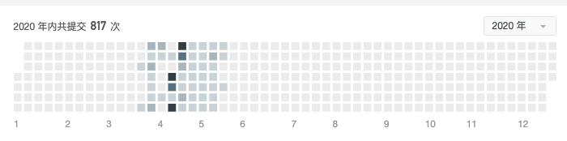
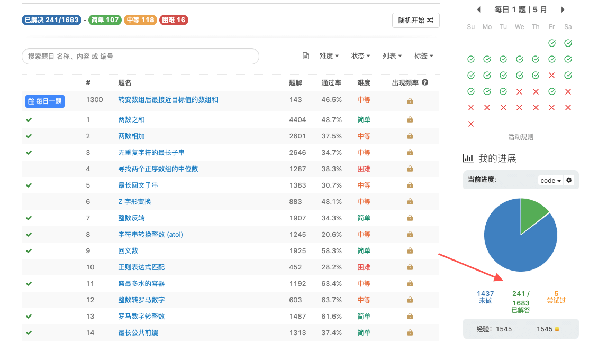
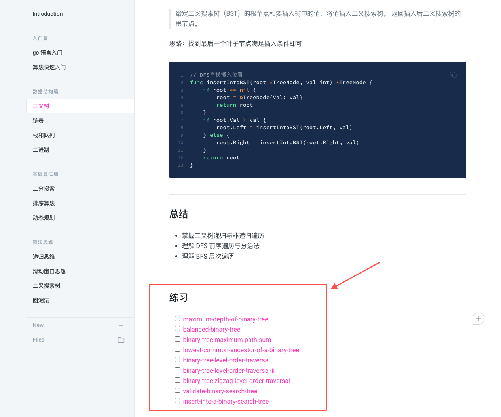
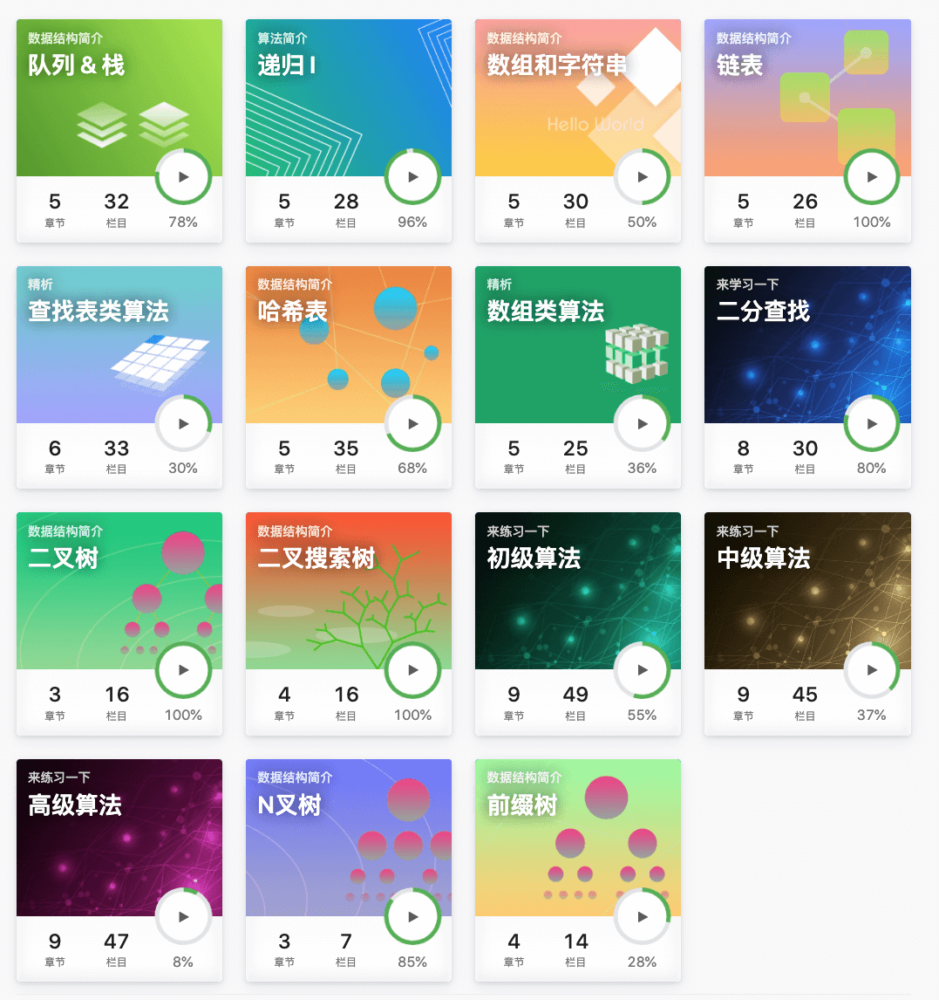
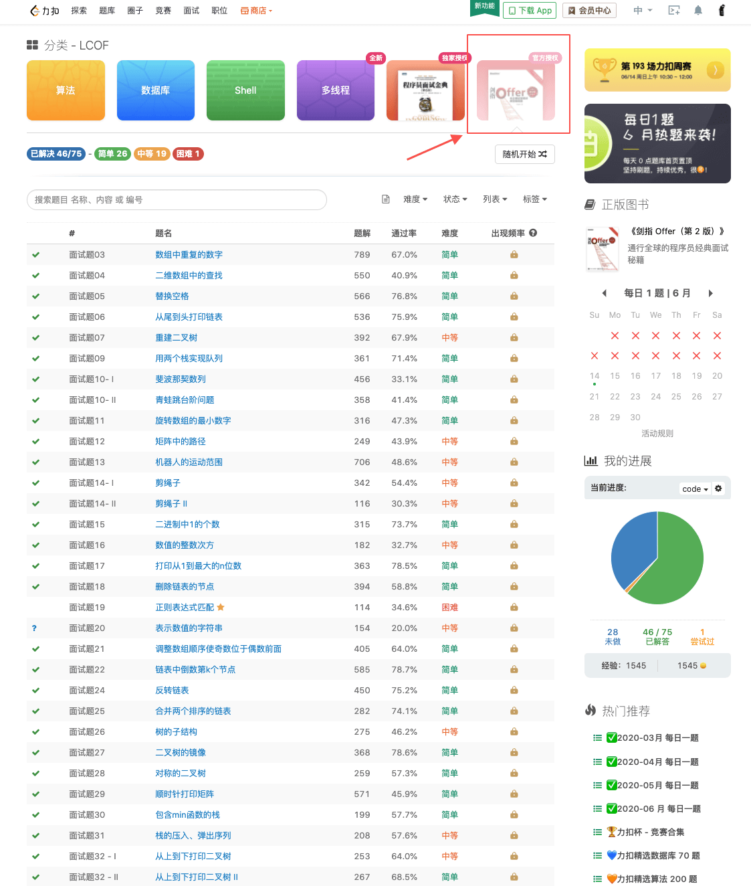

# 说明

本项目为原项目 [algorithm-pattern](https://github.com/greyireland/algorithm-pattern) 的 Python3 语言实现版本，原项目使用 go 语言实现，目前已获 。在原项目基础上，本项目添加了优先级队列，并查集，图相关算法等内容，基本覆盖了所有基础数据结构和算法，非常适合找工作刷题的同学快速上手。以下为原项目 README，目录部分增加了本项目的新内容。

# 算法模板

算法模板，最科学的刷题方式，最快速的刷题路径，一个月从入门到 offer，你值得拥有 🐶~

算法模板顾名思义就是刷题的套路模板，掌握了刷题模板之后，刷题也变得好玩起来了~

> 此项目是自己找工作时，从 0 开始刷 LeetCode 的心得记录，通过各种刷题文章、专栏、视频等总结了一套自己的刷题模板。
>
> 这个模板主要是介绍了一些通用的刷题模板，以及一些常见问题，如到底要刷多少题，按什么顺序来刷题，如何提高刷题效率等。

## 在线文档

在线文档 Gitbook：[算法模板 🔥](https://greyireland.gitbook.io/algorithm-pattern/)

## 核心内容

### 入门篇 🐶

- [使用 Python3 写算法题](./introduction/python.md)
- [算法快速入门](./introduction/quickstart.md)

### 数据结构篇 🐰

- [二叉树](./data_structure/binary_tree.md)
- [链表](./data_structure/linked_list.md)
- [栈和队列](./data_structure/stack_queue.md)
- [优先级队列 (堆)](./data_structure/heap.md)
- [并查集](./data_structure/union_find.md)
- [二进制](./data_structure/binary_op.md)

### 基础算法篇 🐮

- [二分搜索](./basic_algorithm/binary_search.md)
- [排序算法](./basic_algorithm/sort.md)
- [动态规划](./basic_algorithm/dp.md)
- [图相关算法](./basic_algorithm/graph/)

### 算法思维 🦁

- [递归思维](./advanced_algorithm/recursion.md)
- [滑动窗口思想](./advanced_algorithm/slide_window.md)
- [二叉搜索树](./advanced_algorithm/binary_search_tree.md)
- [回溯法](./advanced_algorithm/backtrack.md)

## 心得体会

文章大部分是对题目的思路介绍，和一些问题的解析，有了思路还是需要自己手动写的，所以每篇文章最后都有对应的练习题

刷完这些练习题，基本对数据结构和算法有自己的认识体会，基本大部分面试题都能写得出来，国内的 BAT、TMD 应该都不是问题

从 4 月份找工作开始，从 0 开始刷 LeetCode，中间大概花了一个半月(6 周)左右时间刷完 240 题。

开始刷题时，确实是无从下手，因为从序号开始刷，刷到几道题就遇到 hard 的题型，会卡住很久，后面去评论区看别人怎么刷题，也去 Google 搜索最好的刷题方式，发现按题型刷题会舒服很多，基本一个类型的题目，一天能做很多，慢慢刷题也不再枯燥，做起来也很有意思，最后也收到不错的 offer（最后去了宇宙系）。

回到最开始的问题，面试到底要刷多少题，其实这个取决于你想进什么样公司，你定的目标如果是国内一线大厂，个人感觉大概 200 至 300 题基本就满足大部分面试需要了。第二个问题是按什么顺序刷及如何提高效率，这个也是本 repo 的目的，给你指定了一个刷题的顺序，以及刷题的模板，有了方向和技巧后，就去动手吧~ 希望刷完之后，你也能自己总结一套属于自己的刷题模板，有所收获，有所成长~

## 推荐的刷题路径

按此 repo 目录刷一遍，如果中间有题目卡住了先跳过，然后刷题一遍 LeetCode 探索基础卡片，最后快要面试时刷题一遍剑指 offer。

为什么这么要这么刷，因为 repo 里面的题目是按类型归类，都是一些常见的高频题，很有代表性，大部分都是可以用模板加一点变形做出来，刷完后对大部分题目有基本的认识。然后刷一遍探索卡片，巩固一下一些基础知识点，总结这些知识点。最后剑指 offer 是大部分公司的出题源头，刷完面试中基本会遇到现题或者变形题，基本刷完这三部分，大部分国内公司的面试题应该就没什么问题了~

1、 [algorithm-pattern 练习题](https://greyireland.gitbook.io/algorithm-pattern/)

2、 [LeetCode 卡片](https://leetcode-cn.com/explore/)

2025年，挪到了题库

[题库 - 力扣 (LeetCode) 全球极客挚爱的技术成长平台](https://leetcode.cn/problemset/)

3、 [剑指 offer](https://leetcode-cn.com/problemset/lcof/)

牛客上有一个剑指offer  
力扣上好像没有用了

[剑指offer_在线编程_牛客网](https://www.nowcoder.com/exam/oj/ta?page=1&tpId=13&type=265)

刷题时间可以合理分配，如果打算准备面试了，建议前面两部分 一个半月 （6 周）时间刷完，最后剑指 offer 半个月刷完，边刷可以边投简历进行面试，遇到不会的不用着急，往模板上套就对了，如果面试官给你提示，那就好好做，不要错过这大好机会~

> 注意点：如果为了找工作刷题，遇到 hard 的题如果有思路就做，没思路先跳过，先把基础打好，再来刷 hard 可能效果会更好~

## 面试资源

分享一些计算机的经典书籍，大部分对面试应该都有帮助，强烈推荐 🌝

[我看过的 100 本书](https://github.com/greyireland/awesome-programming-books-1)

## 后续

持续更新中，觉得还可以的话点个 **star** 收藏呀 ⭐️~

【 Github 】[https://github.com/greyireland/algorithm-pattern](https://github.com/greyireland/algorithm-pattern) ⭐️
